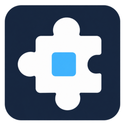

# Mods for T3 Code



Live mods inside T3 Code’s Electron interface: a Mods sidebar button, a Settings → Mods section, themes, commands, sidebar panels, and a band above the prompt. MIT licensed and independent of the T3 team.

Inspired by [Anthropic’s Claude Code mods](https://claude.com/blog/claude-code-mods) and its [mods API reference](https://code.claude.com/docs/en/plugins/mods/reference). This is a T3-specific SDK; Claude Code plugins do not install unchanged.

## Install

Install T3 Code first. On macOS, the installer detects an open T3 app, asks before closing it, shows patch progress, and reopens the same app afterward. On Linux and Windows, close T3 for the initial installation and reopen it using its normal icon. Installing, creating, updating, enabling, and disabling individual mods afterward takes effect immediately.

Linux and macOS:

```sh
curl -fsSL https://raw.githubusercontent.com/hapwi/mods-for-t3-code/main/install.sh | sh
```

Windows, in PowerShell:

```powershell
irm https://raw.githubusercontent.com/hapwi/mods-for-t3-code/main/install.ps1 | iex
```

The installer downloads a commit-pinned archive temporarily and retains only the compiled runtime, maintenance CLI, package metadata, and license. End users need no repository checkout or source files. If necessary it downloads its own Node 24 runtime and verifies the official SHA-256 checksum. The macOS confirmation reads from `/dev/tty`, so it also works when the script is piped into `sh`. Without an interactive terminal, an open app is left untouched and the installer asks you to close it first. No global npm install is needed. It patches T3 at its installed path and keeps a complete original backup; it does not create another app or require a different shortcut.

For an unusual location, download the installer and pass an explicit path:

```sh
curl -fsSL https://raw.githubusercontent.com/hapwi/mods-for-t3-code/main/install.sh -o /tmp/t3-mods-install.sh
sh /tmp/t3-mods-install.sh --appimage /path/to/T3-Code.AppImage
# macOS:
sh /tmp/t3-mods-install.sh --mac-app '/Applications/T3 Code (Alpha).app'
# Writable Linux Electron installations:
sh /tmp/t3-mods-install.sh --asar /opt/t3-code/resources/app.asar
```

If an AppImage path is a shell shim, choose the actual binary, often `T3-Code.AppImage.real`. Existing custom launchers are preserved.

Windows custom installation:

```powershell
Invoke-WebRequest https://raw.githubusercontent.com/hapwi/mods-for-t3-code/main/install.ps1 -OutFile "$env:TEMP\t3-mods-install.ps1"
& "$env:TEMP\t3-mods-install.ps1" -T3Directory 'C:\path\to\T3 Code'
```

## Use

Open the puzzle icon at the bottom of T3’s sidebar, or **Settings → Mods**.

- **Built-in:** install Context Usage or Token Weather. Installed examples show their running state and a live toggle.
- **Installed:** generated mods appear under **Waiting for review**, which survives closing the manager or restarting T3. Review source and permissions, then install to switch the mod on immediately. Rows show Starting, Active, Stopped, Off, Paused, or Safe mode; stopped mods offer Retry and Ask AI to fix. Inspect, export, and remove actions are in the ⋯ menu.
- **Create:** describe a mod and put the generated authoring prompt into the current T3 composer. Choose your already logged-in provider/model and send it normally. The agent returns a manifest and JavaScript in two tagged code blocks. The manager reads the finished native response and lists the mod for review, including remote workspaces and replies outside the visible conversation. A local inbox is also watched. Invalid bundles show a reason and an Ask AI to fix action. No separate AI account or API key is required. The prompt includes T3’s supported surfaces, theme conventions, live lifecycle, and handling for missing context data.
- **Import:** choose a `.t3mod` file or paste a complete bundle or the two tagged blocks from a reply. Validation errors stay beside the input.
- **Edit:** open the ⋯ menu on an installed or built-in mod, choose Edit, and describe the changes. Draft in T3 includes its current source and the mod API in your existing chat. Send the request normally and review the returned update. Installed built-ins use your customized copy as the starting point.
- **Development mode:** automatically apply inbox changes to an enabled mod with the same author and no additional permissions. Expanded permissions always require review.
- **Activity:** inspect mod errors and quarantine reasons. **Pause all** stops every mod immediately.

Prompt modifications ask before inserting into the draft and never send it. Multiple theme mods use the last activated theme; disabling it restores the previous theme, and disabling all theme mods restores T3’s colors. Themes cover native chrome and sidebar rows, including T3’s selected-theme overrides.

### Context Usage

Install **Context Usage** from **Mods → Built-in**. A compact progress ring and percentage appear in the native composer meter slot; click the ring to open **Context Usage** with measured tokens, window capacity, a segmented bar, and category rows matching the Cursor-style inspector. Escape, clicking outside, or the close button dismisses it. Disabling the mod restores T3’s original meter. Older layouts show the control above the composer.

The categories are System prompt, Tool definitions, Rules, Skills, MCP & dynamic tools, Summarized conversation, and Conversation. T3’s current usage contract reports the total but does **not** provide these category counts. They show **Unavailable**, with the measured total under **Unclassified context**; nothing is estimated or shown as a fabricated zero. A numeric `breakdown` from T3 can populate the categories when available. The ring stays hidden before a measurement and handles unknown window sizes without guessing.

### Token Weather

A compact, colored line above the prompt shows the measured context percentage, tokens used/window size, and the change since the previous completed turn:

```text
☂ Showers  67%  134.4k / 200k  ▲ +98.3k last turn
```

Weather thresholds are Clear below 25%, Cloudy below 50%, Showers below 75%, Storm below 90%, and Compact soon at 90% or higher. Measurements refresh as T3 reports them; history advances on completed turns. The turn delta appears once two completed turns have been measured. Compaction can produce a negative change.

Counts come from T3’s normalized provider usage reports, including warm thread-cache hydration, not text-length estimates or account rate limits. The band stays hidden until a measurement exists. If a provider supplies usage without the window size, it shows measured tokens and a window-unknown note. History is separate for each thread.

## Updates and recovery

The patch adds a small bootstrap to the Electron entry point **inside your installed T3 app**. macOS bundles, Windows installation directories, and Linux AppImages stay at their existing paths. Your ordinary app icon opens T3 with Mods.

- The installer stages and checks the patch before replacing the installed app. A full backup preserves the original macOS signature, Windows executable, or AppImage for uninstall.
- Reinstall refreshes the host without patching twice. A clean upstream replacement gets a new backup and patch. Uninstall refuses to overwrite an updated app with an older backup.
- T3’s updater remains enabled. An upstream update can replace the patch; rerun the same installation command to restore Mods, or use the maintenance command with `launch` to reapply before opening T3. Automatic reapplication when opening the ordinary icon after an update is not yet implemented.
- Mods declare SDK API version 1. Failed or stalled mods are stopped and quarantined. Future changes to T3’s DOM, provider protocol, signing, or updater may require a host update; arbitrary future compatibility cannot be guaranteed.

The installer prints the command path. Typical paths:

| Platform | Command |
| --- | --- |
| Linux | `~/.local/share/mods-for-t3-code/tools/mods-for-t3-code` |
| macOS | `~/Library/Application Support/Mods for T3 Code/tools/mods-for-t3-code` |
| Windows | `%APPDATA%\Mods for T3 Code\tools\mods-for-t3-code.cmd` |

Use that command with `doctor`, `safe-mode on`, `safe-mode off`, or `uninstall`. For a direct archive install, pass `uninstall --asar /path/to/app.asar`. Close T3 before uninstalling. Uninstall restores the installed app and keeps private mod data; the maintenance tool can be removed separately.

`T3_MODS_DISABLE=1` bypasses the host on launch. Safe mode loads the manager without running any mod code. For immediate recovery in a running app, use **Pause all**.

The patched macOS app is ad-hoc signed. macOS may require renewed app permissions or Keychain access, which can affect existing provider sign-ins. Local signing can also interfere with [Squirrel automatic updates](https://www.electronjs.org/docs/latest/api/auto-updater); normal updates while the patch is installed are not verified. If T3 reports an update installation error, close T3 and run the maintenance tool with `prepare-update`:

```sh
curl -fsSL https://raw.githubusercontent.com/hapwi/mods-for-t3-code/main/install.sh | sh -s -- --prepare-update
```

The curl recovery command downloads the current maintenance tool without reinstalling the patch. If that tool is already current, you can run it directly with `prepare-update`. It restores the verified original vendor-signed app at its existing path, preserves private mod data, and refuses to overwrite an upstream replacement. Reopen T3 with its normal icon and update through T3. Rerun the installer afterward to restore Mods. This is recovery, not seamless native update compatibility; the patch does not change update feeds or bypass signature checks. Windows’s modified executable also loses its publisher signature. The complete original signed app is backed up for restoration. The installer does not turn off Gatekeeper, Electron’s sandbox, ASAR validation, or security fuses.

## Build and share a mod

Clone this repository and run `npm ci`. Start from a directory under `examples/`. Each mod has `mod.json` and a JS/TS entry exporting `activate(api)`:

```js
export async function activate(api) {
  await api.panels.set({ title: 'Hello', body: 'A small addition to T3.' });
}
```

Declare `ui.panels` in the manifest’s `permissions`. Bundle and validate:

```sh
node dist/cli.mjs pack examples/focus-timer --out focus-timer.t3mod
node dist/cli.mjs validate focus-timer.t3mod
```

Share the `.t3mod` file. Recipients import it from the manager, inspect permissions/source, and confirm installation to activate it. Files in the inbox follow the same review flow. SDK types are in [sdk.d.ts](sdk.d.ts); authoring examples are in [examples](examples).

Mod code runs in isolated workers inside opaque sandboxed iframes. It has no direct access to Electron, Node, the app DOM, network, provider credentials, or T3’s database. Host capabilities are checked on every call. UI uses bounded text and approved theme tokens; private storage is limited to 64 KB per mod. This is a practical isolation layer, not a guarantee against browser vulnerabilities.

Mod settings and storage use their own IndexedDB database in T3’s renderer profile. Installer metadata, the inbox, and original app backups live under the command’s data directory; override it with `MODS_FOR_T3_DATA` before installing.

## Development and validation

```sh
npm ci
npm run typecheck
npm run build
npm run pack:examples
npm run demo
# In a second terminal:
node scripts/browser-check.ts --context-usage
```

Production source, example mods, and development scripts use TypeScript with strict checking. `dist/` contains the compiled JavaScript and bundled CLI, so end-user installations need no compiler, build toolchain, or npm dependencies. Regenerate it when runtime or bundled mods change. Focused archive, manifest, telemetry, and update tests live under `test/`; set `MODS_FOR_T3_DATA` to a temporary directory when running installer tests.

Focused archive, telemetry, and renderer checks cover T3 `0.0.46-nightly.20261003.2623`. An isolated Electron 44.4.2 window uses the packaged CSP, sandbox, context isolation, shipped host, and real mod workers. Its integration check covers native hash navigation, WebSocket/HTTP reports, warm-cache hydration, forecast/turn deltas, composer spacing, built-in installation state, native AI handoff without rendered code, persistent review after renderer remount, live toggling, and cleanup. Run it with `node scripts/electron-integration-check.ts /path/to/electron`. Focused Chromium checks cover manager flows and theme application/restoration against native 2632/2638 CSS rules. Strict TypeScript checking and earlier temporary CLI/macOS install-and-restore fixtures pass. An earlier patch launched in the existing macOS Nightly app; this revision has not been installed on the user's Mac. macOS end-user installation, Windows runtime/signing and native updater flows still require platform testing.


See [architecture](docs/architecture.md), [changelog](CHANGELOG.md), and [license](LICENSE).
